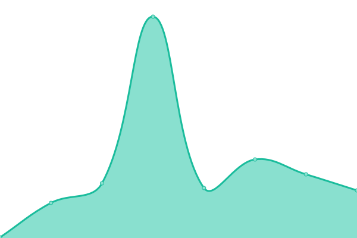
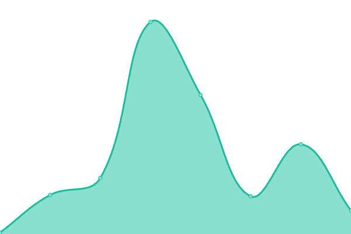
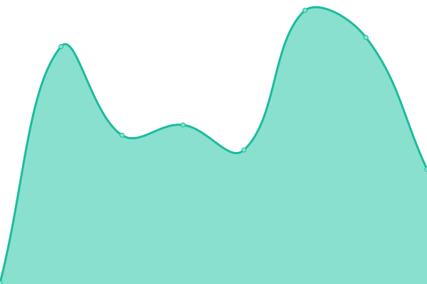

# [📈 Live Status](https://yaofan.pro): <!--live status--> **🟧 Partial outage**

This repository contains the open-source uptime monitor and status page for [wangye](https://yaofan.pro), powered by [Upptime](https://github.com/upptime/upptime).

With [Upptime](https://upptime.js.org), you can get your own unlimited and free uptime monitor and status page, powered entirely by a GitHub repository. We use [Issues](https://github.com/wyvwly/upptime/issues) as incident reports, [Actions](https://github.com/wyvwly/upptime/actions) as uptime monitors, and [Pages](https://yaofan.pro) for the status page.

<!--start: status pages-->
<!-- This summary is generated by Upptime (https://github.com/upptime/upptime) -->
<!-- Do not edit this manually, your changes will be overwritten -->
<!-- prettier-ignore -->
| URL | Status | History | Response Time | Uptime |
| --- | ------ | ------- | ------------- | ------ |
|  [Google](https://www.google.com) | 🟩 Up | [google.yml](https://github.com/wyvwly/upptime/commits/HEAD/history/google.yml) | 

 84ms
     
 | 

<a href="https://wyvwly.github.io/upptime/history/google">100.00%</a>
    

|  [GitHub Pages](https://wyvwly.github.io) | 🟥 Down | [git-hub-pages.yml](https://github.com/wyvwly/upptime/commits/HEAD/history/git-hub-pages.yml) | 

 76ms
     
 | 

<a href="https://wyvwly.github.io/upptime/history/git-hub-pages">0.00%</a>
    

|  [yaofan](https://yaofan.pro) | 🟩 Up | [yaofan.yml](https://github.com/wyvwly/upptime/commits/HEAD/history/yaofan.yml) | 

 132ms
     
 | 

<a href="https://wyvwly.github.io/upptime/history/yaofan">100.00%</a>
    

<!--end: status pages-->

[**Visit our status website →**](https://yaofan.pro)

## 📄 License

- Powered by: [Upptime](https://github.com/upptime/upptime)
- Code: [MIT](./LICENSE) © [wangye](https://yaofan.pro)
- Data in the `./history` directory: [Open Database License](https://opendatacommons.org/licenses/odbl/1-0/)
